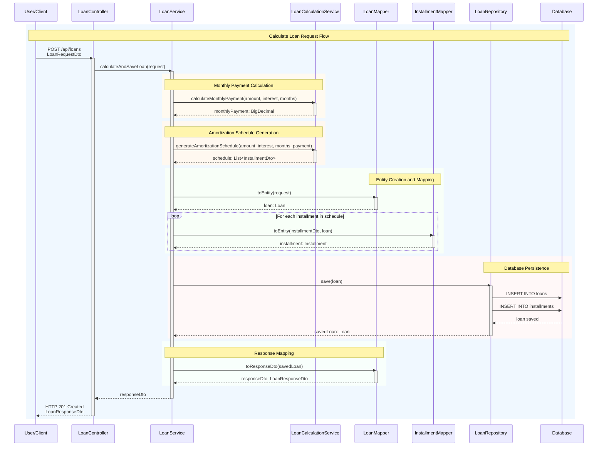

# Loan Calculator - Sequence Diagram

## Flow Explanation

1. **User Request**: Client sends POST request with loan parameters
2. **Monthly Payment**: Calculate using standard loan formula
3. **Amortization Schedule**: Generate month-by-month breakdown
4. **Entity Mapping**: Convert DTOs to JPA entities
5. **Database Save**: Persist loan and installments
6. **Response Mapping**: Convert entities back to DTOs
7. **HTTP Response**: Return calculated results

## Color Coding

- **🔵 Blue**: Main request flow
- **🟠 Orange**: Payment calculations
- **🟡 Yellow**: Schedule generation
- **🟢 Green**: Data mapping
- **🔴 Red**: Database operations
- **🟣 Purple**: Response preparation
